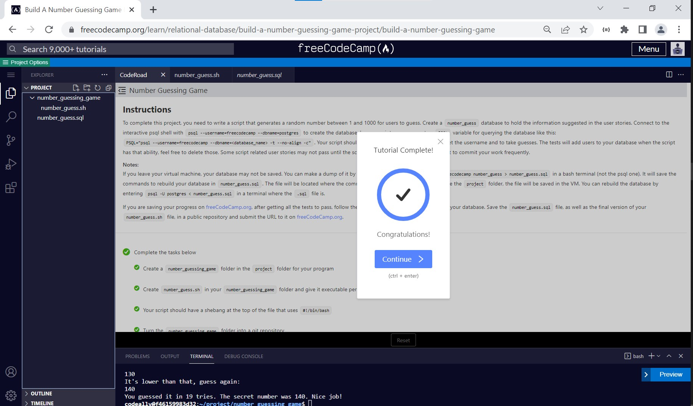
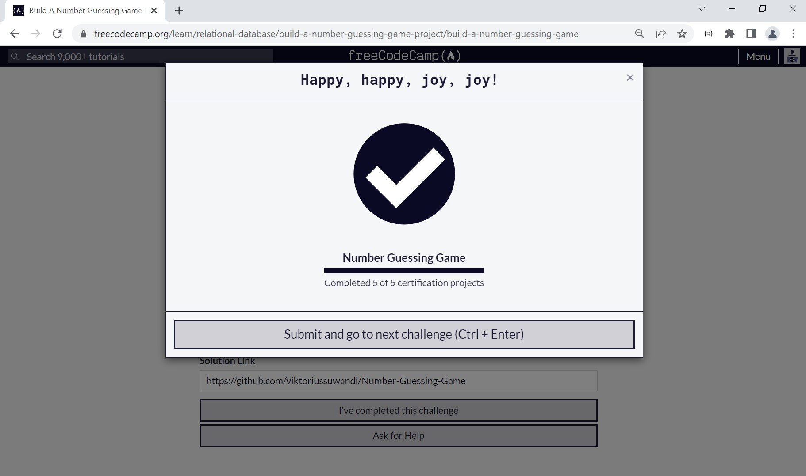

# Number Guessing Game
#### Open [file `solution.txt`](solution.txt) To follow my terminal command. Solutions divided into several steps :
    1. 

#### Solution can be found on : [https://replit.com/@ViktoriusSuwand/Number-Guessing-Game](https://replit.com/@ViktoriusSuwand/Number-Guessing-Game)

#### Documentation can be found on :

This is the result to complete the Number Guessing Game project. 
Instructions for building this project can be found at [https://www.freecodecamp.org/learn/relational-database/build-a-number-guessing-game-project/build-a-number-guessing-game](https://www.freecodecamp.org/learn/relational-database/build-a-number-guessing-game-project/build-a-number-guessing-game)

## Instructions

## CodeRoad

## Result

### Testing

### Submission
